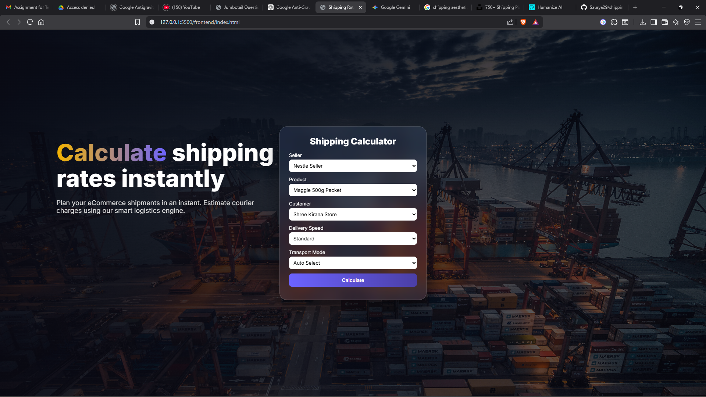
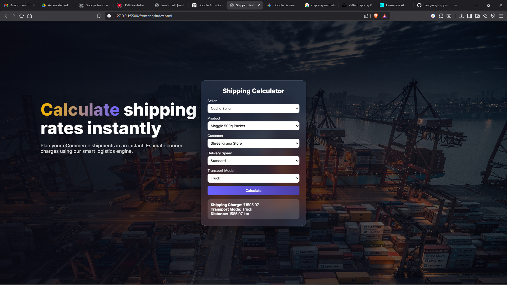

You’re right 👍 — your current README is not cleanly formatted in GitHub (no proper headings, bullets, or tables rendering properly).

Here is a **properly optimized, clean Markdown version** that will render correctly on GitHub with:

* ✅ Proper headings
* ✅ Bullet points
* ✅ Tables
* ✅ Code blocks
* ✅ Clean spacing
* ✅ Professional formatting

Just copy-paste this exactly into `README.md`.

---

# 🚚 Shipping Estimator

A full-stack logistics shipping rate calculator built using **Node.js, Express, MongoDB, and Vanilla JavaScript**.

It calculates shipping charges based on:

* Distance
* Product weight
* Transport mode
* Delivery speed

---

## ✨ Features

* 📍 Nearest warehouse detection
* 📏 Haversine distance calculation
* 🚛 Automatic & manual transport mode selection
* ⚡ Express delivery surcharge support
* 🎨 Glassmorphism UI with cinematic background
* 🔌 RESTful API architecture

---

## 🧮 Shipping Cost Formula

```
Shipping Cost =
(distance × weight × transportRate)
+ Base Charge
+ Express Surcharge (if applicable)
```

---

## 🚛 Transport Rates

| Mode      | Rate Multiplier |
| --------- | --------------- |
| Mini Van  | 3               |
| Truck     | 2               |
| Aeroplane | 1               |

---

## 🚦 Auto Mode Logic

* Distance > 500 km → Aeroplane
* Distance > 100 km → Truck
* Otherwise → Mini Van

---

## 🛠 Tech Stack

### Backend

* Node.js
* Express.js
* MongoDB
* Mongoose

### Frontend

* HTML
* CSS
* Vanilla JavaScript

---

## 📂 Project Structure

```
Shipping_Estimator/
├── src/
│   ├── controllers/
│   ├── models/
│   ├── routes/
│   └── services/
├── frontend/
│   └── assets/
├── server.js
├── package.json
└── README.md
```

---

## ⚙️ Setup Instructions

### 1️⃣ Install Dependencies

```
npm install
```

### 2️⃣ Create `.env` File

```
PORT=5000
MONGO_URI=your_mongodb_connection_string
```

### 3️⃣ Run the Server

```
npm run dev
```

Server runs at:

```
http://localhost:5000
```

---

## 🌍 API Endpoint

### Calculate Shipping

**Method:** `POST`
**Endpoint:** `/api/v1/shipping-charge/calculate`

### Request Body

```json
{
  "sellerId": "",
  "productId": "",
  "customerId": "",
  "deliverySpeed": "standard",
  "transportMode": ""
}
```

---

## 📸 Screenshots

### 🏠 Home Screen



---

### 📊 Calculation Result



---
